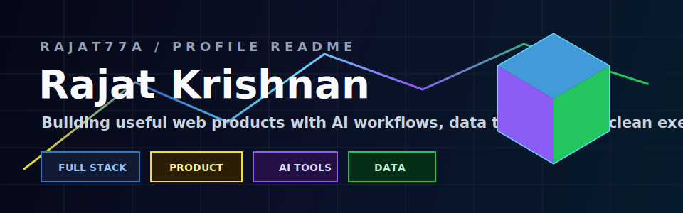

<p align="center">
  
</p>

<p align="center">
  
</p>

## About Me

```ts
const rajat = {
  role: "Integrated MTech CSE student @ VIT",
  location: "India",
  focus: ["AI products", "full-stack web apps", "automation", "data analysis"],
  currentlyBuilding: "PrepPeer - an AI mock interview platform for Indian job seekers",
  mindset: "Learn fast, build clearly, improve every version"
};
```

- Building **PrepPeer**, an AI mock interview platform with role-specific questions, instant AI scoring, live leaderboards, and shareable score cards.
- Developing **GridWatch**, an energy theft detection and grid monitoring system using anomaly detection and geospatial dashboards.
- Exploring how **AI, product design, and real-world user workflows** can come together in useful tools.
- Working across **Python, Java, C, JavaScript, TypeScript, backend APIs, notebooks, and frontend systems**.
- Open to collaborating on projects that mix **AI, web, education, data, or creator tools**.

## Tech Arsenal

<div align="center">
  
</div>

<br />

| Build Stack | AI Workbench | Data + Automation |
| --- | --- | --- |
| Next.js, React, Tailwind | Cursor, Codex, Claude | Python, Pandas, Notebooks |
| Node.js, Express, REST APIs | Antigravity, Windsurf, ChatGPT | SQLite, MongoDB, Plotly |
| TypeScript, JavaScript, Java | Gemini, Perplexity, Lovable | Streamlit, n8n, workflow tools |

## Featured Work

| Project | What It Shows | Open |
| --- | --- | --- |
| **PrepPeer** | Interview practice product with scoring, leaderboard, and shareable results | [Live app](https://prep-peer.vercel.app) / [Repo](https://github.com/Rajat77a/PrepPeer) |
| **Bitcoin Sentiment Analysis** | Trading data exploration against market sentiment signals | [Repo](https://github.com/Rajat77a/bitcoin-sentiment-analysis) |
| **University Event Management** | Full-stack platform thinking: roles, registration, events, APIs | [Repo](https://github.com/Rajat77a/university-event-management-system) |
| **ZedWorks Portfolio** | Creative brand experiments, content systems, and product storytelling | [Repo](https://github.com/Rajat77a/ZedWorks-portfolio) |

## GitHub Dashboard

<div align="center">
  
</div>

<div align="center">
  
</div>

## Contribution Snake

<div align="center">
  <picture>
    <source media="(prefers-color-scheme: dark)" srcset="https://raw.githubusercontent.com/Rajat77a/Rajat77a/output/github-contribution-grid-snake-dark.svg" />
    <source media="(prefers-color-scheme: light)" srcset="https://raw.githubusercontent.com/Rajat77a/Rajat77a/output/github-contribution-grid-snake.svg" />
    
  </picture>
</div>

## More About The Build

<details>
  <summary><strong>What I like building</strong></summary>
  <br />
  <p>Products that feel useful immediately: AI workflows, education tools, dashboards, community platforms, automation pipelines, data projects, and creative brand experiences.</p>
</details>

<details>
  <summary><strong>Current focus</strong></summary>
  <br />

  - Building PrepPeer into a reliable AI interview platform.
  - Improving backend security, authentication, and leaderboard systems.
  - Exploring LLM workflows, automation pipelines, and AI-assisted development.
  - Strengthening practical software engineering through shipped projects.
</details>

<details>
  <summary><strong>Current repositories on my map</strong></summary>
  <br />

  - <a href="https://github.com/Rajat77a/PrepPeer"><strong>PrepPeer</strong></a> - AI mock interviews with scoring, leaderboards, and shareable score cards.
  - <a href="https://github.com/Rajat77a/bitcoin-sentiment-analysis"><strong>bitcoin-sentiment-analysis</strong></a> - Hyperliquid trading data analyzed against the Fear and Greed Index.
  - <a href="https://github.com/Rajat77a/university-event-management-system"><strong>university-event-management-system</strong></a> - JavaScript-based event management work.
  - <strong>GridWatch</strong> - Energy theft detection and grid monitoring with anomaly detection, Streamlit, Pandas, Folium, SQLite, and Plotly.
  - <a href="https://github.com/Rajat77a/GITTYUP-2025"><strong>GITTYUP-2025</strong></a> - HTML template repo for participants.
  - <a href="https://github.com/Rajat77a/ZedWorks-portfolio"><strong>ZedWorks-portfolio</strong></a> - Creative product posts, captions, and content ideas.
</details>

## Connect

| Start Here | Best For |
| --- | --- |
| [Launch PrepPeer](https://prep-peer.vercel.app) | Seeing my product work in action |
| [Connect on LinkedIn](https://www.linkedin.com/in/rajat-krishnan77) | Recruiters, collaborators, and project conversations |
| [Email Me](mailto:rajatkrishnan321@gmail.com) | Direct opportunities and quick reach-outs |
| [Explore My GitHub](https://github.com/Rajat77a) | Code, experiments, and active repositories |
